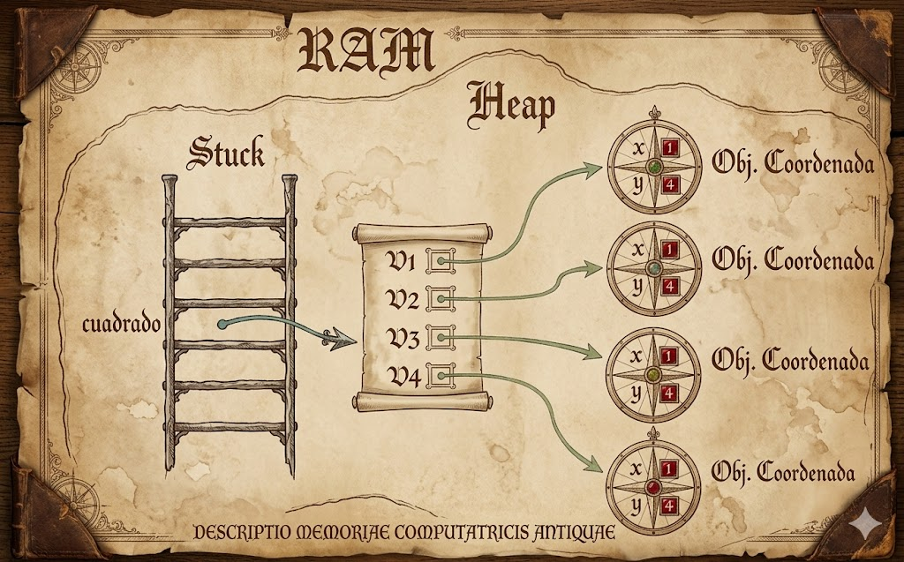

# python_POO
Introducción a la Programacion Orientada a Objetos (POO)

## ¿por qué aprender POO?

- Imagina que quieres crear un videojuego, tienes herreros, magos dragones... cada uno con sus propios puntos de vida, ataques y habilidades. ¿como los organizo en código sin repetirlos todos de una vez?

-La "programacion orientada a objetos (POO)" es la respuea, en lugar de escribir instrucciones sueltas, modelas el mundo real con *objetos* que tienen caracteristicas y comportamientos. Es la forma en la que están construidos la mayoria de programas profesionales en el mundo.


## clase y objeto
- una clase es un tipode gato cuyas variabless se llaman objetos o instancia. 
- la clase es la definición del mundo real y los objetos o instanciasson el propio "objeto" del mundo real. 
- las clases estan compuestas por dos eementos:
    - **atributos:** informacion que almacena la clase
    - **metodos:** operaciones que pueden realizarse con la clase

## Definicion de una clase en python

```python
class nombreClass:

    def __init__(self, variable1, variable2):
        self.atributo1 = valor1
        self.atributo2 = valor2

    def nombreMetodo(self):
        BloqueCodigo
```

- `class` : palabra reservada en python para definir una clase
- `ǸombreClase`: nombre de la clase que se quiere crear
- `def`: palabra reservada en python que se utiliza para definir tanto el constructor e la clase (metodo que se ejecuta la primera vez que usas na clase) como los diferentes metodos que tiene.
- `__init__`: palabra reservada en python para defnir el metodo constructor de la clase. el metodo `__init__`es lo primero que se ejecuta cuando creas un objeto en una clase.
- `(self, variableX)`:parámetro del constructor de la clase, y el parámetro `self`es obligatorio y despues puedes tener tantos parámetros como quieras. La forma de añadir paramentros es a misma que en las funciones.
-`self.AtributoX`: forma de utilizacion y acceso a los atributos de la clase
-ǹombreMetodo`: nombre del metodo de la clase
- `self`: parámetro de el metodo. el parametro `self`es obligatorio y despues puedes tener tantos parametros como quieras. La forma de añadir paramentros es a misma que en las funciones.
- `BloqueCodigo`:instrucciones que ejecutaran el metodo

**al definir una clase tenga en cuenta:**
- puede definir tantos atributos como necesite
- puede definir tantos metodos como necesite
- puedes definir tantos parametros en el constructor y en los metodos que necesite.

## ejemplo 1

- crear una clase que represente una persona 
- atributos: nombre, apellido y edad 
- metodo: mostrar la informacion de la persona 

### codigo
```python 
class personal: 

    def _init_(self, nombre, apellido, edad):
        self,nombre = nombre 
        self,apellido = apellido
        self,edad = edad 
    
    def mostrarpersona(self):
        print("nombre: ", self.nombre)
        print("apellido: ", self.apellido)
        print("edad: ", self.edad)

def main():
    print("vamos a aprender poo...")
    persona_1 = persona("lorenzo", "perez",18)

if _name_ == main():
    main()
```

## representacion en ram del objeto creado


## coomposicion 
- consiste en a creacion de nuevas clases a partir de otras clases ya existen que actuan como elementoscompositores de la nueva.
- las clasese existentes seran atributos de la nueva clase.

### ejemplo 

- una cordenada en dos dinmensiones esta compuesto por dos valores, el valor en el eje de las x y el valor en el eje de las y. esto podria ser una clase
- un cuadrado esta compuesto por 4 coordenadas que son los cuatro vertices. esto podria ser una clase que esta compuesto por cuatro clases de objetos coordenada.

### codigo python
```python
class coordenada:
    # metodo constuctor 
    det __init__(self, x, y):
        self.__x = x
        self.__y = y

        # metodos de acceso
        def getX(self):
            return self.__X

        def setx(self, x):
            self.__x = x

        def setY(self):
            return self.__y

        def setY(self):
            self.__y = y

    def mostrarcoordenada(self):
        print("(",self.__x,",",self.__y, ")")

class cuadrado:
    # metodo constructor 
    def __init__(self, v1, v2, v3, v4):
        self.v1 = v1
        self.v2 = v2
        self.v3 = v3
        self.v4 = v4

    def mostrarvertices(self):
        print("el cuaadrado esta  compuesto por los siguientes vertices: ")
        self.v1.mostrarcoordenadas() 
        self.v2.mostrarcoordenadas() 
        self.v3.mostrarcoordenadas() 
        self.v4.mostrarcoordenadas() 
```

### representacion grafica del objeto



## encapsulacion

- uno de los objetivos quetiene la POO es proteger los datos de acceso o usos no controlados y esto es como se conose como **encapsulacioan**
- los atributos que componen una clase pueden ser de 2 tipos:
    - **publicos**:los datos son accesibles sin contron es decir los datos pueden ser usados sin ningun tipo de mecanismo que proteja ante usos no autorisados o indebidos
    - 
- la encapsulacion tambien puede realizarse sobre los metodos.
- la definicion de atrivutos privados se realisan inclutyendo los caracteres(dos rallas de piso)
entre la palabra **self** y el nombre del atributo

### ejemplo

### codigo en python

```python
class coordenada:
    # metodo constuctor 
    det __init__(self, x, y):
        self.__x = x
        self.__y = y

        # metodos de acceso
        def getX(self):
            return self.__X

        def setx(self, x):
            self.__x = x

        def setY(self):
            return self.__y

        def setY(self):
            self.__y = y

    def mostrarcoordenada(self):
        print("(",self.__x,",",self.__y, ")")
```

## Herencia
- Permite la reutilización de código.
- Consiste en la definición de una clase utilizando como base una clase ya existente.
- La nueva clase derivada tendrá todas las caracteristicas de la clase base y ampliará el concepto de esta, es decir, tendrá todos los atributos y métodos de la clase base.
- Significa que entre dos clases existe una relación del tipo "es un".
- La herencia en Python se especifica de la siguiente manera: ```class NombreClase(ClaseBase):```
- Ejemplo:
    - Pensemos en una persona como una clase, la persona tendría una serie de atributos como pueden ser el nombre, los apellidos, la edad, etc.  Esas características de una persona serían compartidas por todas aquellas clases hijas como pueden ser alumno y profesor.  Es decir, alumno y profesor heredarían las propiedades de la clase persona y tendrían sus propias propiedades, diferentes entre ellas, como por ejemplo el curso en el que está el alumno y el horario de tutorias del profesor.

    - Clase base: Persona
        - Atributos:
            - Nombre
            - Apellidos
            - Edad

    - Clase derivada: Alumno
        - Atributos:
            - Curso
            - Asignaturas
    
    - Clase derivada: Profesor
        - Atributos:
            - Antigüedad
            - Tutorias
            - Teléfono