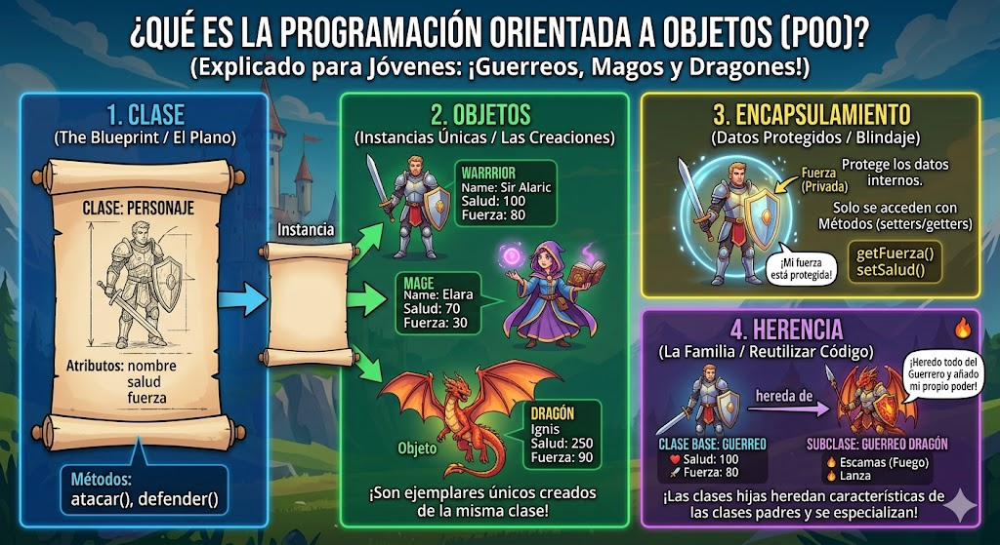

# python_POO
Introducción a la Programacion Orientada a Objetos (POO)

## ¿por qué aprender POO?

- Imagina que quieres crear un videojuego, tienes herreros, magos dragones... cada uno con sus propios puntos de vida, ataques y habilidades. ¿como los organizo en código sin repetirlos todos de una vez?

-La "programacion orientada a objetos (POO)" es la respuea, en lugar de escribir instrucciones sueltas, modelas el mundo real con *objetos* que tienen caracteristicas y comportamientos. Es la forma en la que están construidos la mayoria de programas profesionales en el mundo.



## clase y objeto
- una clase es un tipode gato cuyas variabless se llaman objetos o instancia. 
- la clase es la definición del mundo real y los objetos o instanciasson el propio "objeto" del mundo real. 
- las clases estan compuestas por dos eementos:
    - **atributos:** informacion que almacena la clase
    - **metodos:** operaciones que pueden realizarse con la clase

## Definicion de una clase en python

```python
class nombreClass:

    def __init__(self, variable1, variable2):
        self.atributo1 = valor1
        self.atributo2 = valor2

    def nombreMetodo(self):
        BloqueCodigo
```

- `class` : palabra reservada en python para definir una clase
- `ǸombreClase`: nombre de la clase que se quiere crear
- `def`: palabra reservada en python que se utiliza para definir tanto el constructor e la clase (metodo que se ejecuta la primera vez que usas na clase) como los diferentes metodos que tiene.
- `__init__`: palabra reservada en python para defnir el metodo constructor de la clase. el metodo `__init__`es lo primero que se ejecuta cuando creas un objeto en una clase.
- `(self, variableX)`:parámetro del constructor de la clase, y el parámetro `self`es obligatorio y despues puedes tener tantos parámetros como quieras. La forma de añadir paramentros es a misma que en las funciones.
-`self.AtributoX`: forma de utilizacion y acceso a los atributos de la clase
-ǹombreMetodo`: nombre del metodo de la clase
- `self`: parámetro de el metodo. el parametro `self`es obligatorio y despues puedes tener tantos parametros como quieras. La forma de añadir paramentros es a misma que en las funciones.
- `BloqueCodigo`:instrucciones que ejecutaran el metodo

**al definir una clase tenga en cuenta:**
- puede definir tantos atributos como necesite
-puede definir tantos metodos como necesite
- puedes definir tantos parametros en el constructor y en los metodos que necesite.

